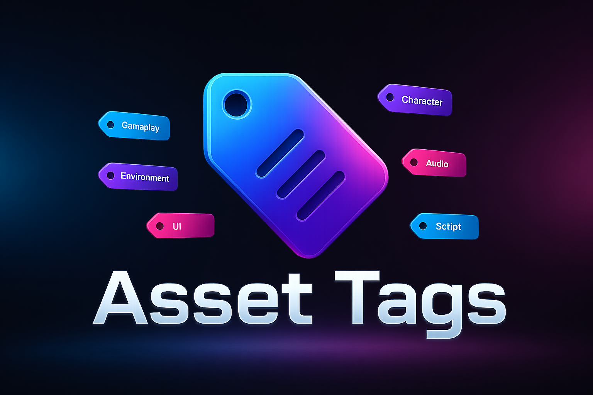
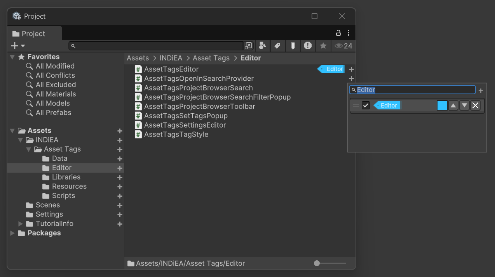

# Asset Tags

---

© 2025-2026 **INDiEA Games**. All rights reserved.

---

## Introduction

**Asset Tags** is a Unity editor extension designed to create a dedicated classification layer separate from Unity Asset Labels, while still allowing interoperability when needed. It helps teams assign tags to assets, search them quickly in the Project Browser, and maintain collaboration-friendly metadata with JSON persistence.

---

## Overview

| Item    | Details |
| ------- | ------- |
| Name    | INDiEA Asset Tags |
| Version | `1.0.0` |
| Unity   | **2021.2** or newer |
| Scope   | Editor extension for Project Browser tagging and search |

---

## Requirements

| Symbol | Meaning |
| ------ | ------- |
| **O**  | Verified |
| **X**  | Not verified |
| **△**  | Partially verified |

---

| Version     | Built-In | URP | HDRP |
| ----------- | -------- | --- | ---- |
| 2021.3.0f1  | O        | O   | O    |
| 2022.3.0f1  | O        | O   | O    |
| 6000.0.23f1 | O        | O   | O    |

- Runtime: Editor-only (`#if UNITY_EDITOR`)
- [0Harmony](https://github.com/pardeike/Harmony): Required for Project Browser toolbar/search integration 

---

## Quick Start

1. Import the package into your Unity project.
2. Let scripts compile, then open the Project Browser.
3. Assign tags to assets from the Asset Tags UI.
4. Search with `tag:<keyword>` (for example, `tag:ui`, `tag:vfx`, `tag:all`).

---

## Key Features

- **Multi-tag assignment** per asset GUID.
- **Search integration** with `tag:` syntax in Project Browser / search provider.
- **Tag list management** (name, color, order).
- **Per-tag metadata tracking** using `lastModifiedAtUtc` and `lastModifiedBy`.
- **Local-first persistence** for safer team workflows.
- **Asset Tags/Labels conversion tools** for interoperability.

---

## Search Syntax

| Query | Description |
| ----- | ----------- |
| `tag:<keyword>` | Case-insensitive partial match |
| `tag:all` | Returns all tagged assets |
| `AssetTags\<keyword>` | Legacy syntax (supported) |
| `AssetTags\all` | Legacy all query |

---

## Team Collaboration Strategy

When multiple developers edit tags at the same time, teams usually face three problems:

1. **Frequent merge conflicts** when everyone writes to one shared tag file
2. **Accidental overwrite** of someone else’s edits during rebase/merge
3. **Hard-to-trace changes** when there is no per-tag modification metadata

Asset Tags addresses these issues with a **local-first + overlay merge** structure.

### 1) Local editable files (Git-trackable)

Each client writes only to its own local JSON files:

- `Assets/INDiEA/Asset Tags/Data/AssetTagsData_<clientId>.json`
- `Assets/INDiEA/Asset Tags/Data/AssetTagsList_<clientId>.json`

This reduces direct write contention between users and keeps edits scoped per client.

### 2) Global cache as read-only runtime base

At runtime, the system also reads cache files from:

- `Library/INDiEA/Asset Tags/Data/AssetTagsData.json`
- `Library/INDiEA/Asset Tags/Data/AssetTagsList.json`
- `Library/INDiEA/Asset Tags/Data/ClientId.json`

These are treated as a **read-only base** for loading state, not as the normal save target for user edits.

### 3) Overlay merge behavior

The in-memory state is built as:

- load global cache first
- overlay local data on top
- if entries overlap, local entry wins
- save operations write to local JSON only

In short, this model minimizes team collisions while preserving each user’s latest intent in their own editable source files.

---

## Asset Tags Settings

| Setting | Type | Default | Description |
| ------- | ---- | ------- | ----------- |
| `overrideProjectBrowserToolbar` | bool | `true` | Replaces Unity Project Browser toolbar behavior with Asset Tags toolbar integration. |
| `enableDiagnosticLogs` | bool | `true` | Enables internal diagnostic logs to help inspect toolbar/search and data flow behavior. |

---

| Button | Description |
| ------ | ----------- |
| `Sync Current Snapshot To Local JSON` | Writes the current in-memory merged snapshot to local JSON files. |
| `Convert All Asset Tags To Asset Labels` | Copies Asset Tags into Unity Asset Labels for all project assets (with confirmation dialog). |
| `Convert All Asset Labels To Asset Tags` | Imports Unity Asset Labels into Asset Tags data and tag list (with confirmation dialog). |

Asset Tags provides two-way conversion utilities so you can interoperate with Unity's built-in Asset Labels workflow.

---

## Contact & Support

- **GitHub:** [github.com/INDiEA-Games/Asset-Tags](https://github.com/INDiEA-Games/Asset-Tags)
- **Discord:** [discord.gg/53FQb6dbFd](https://discord.gg/53FQb6dbFd)
- **Email:** [indiea.games.dev@gmail.com](mailto:indiea.games.dev@gmail.com)
